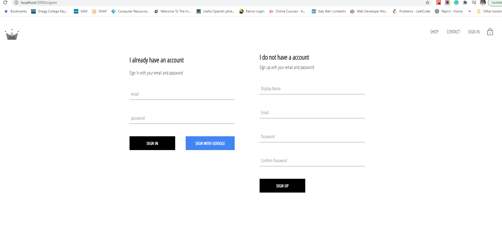
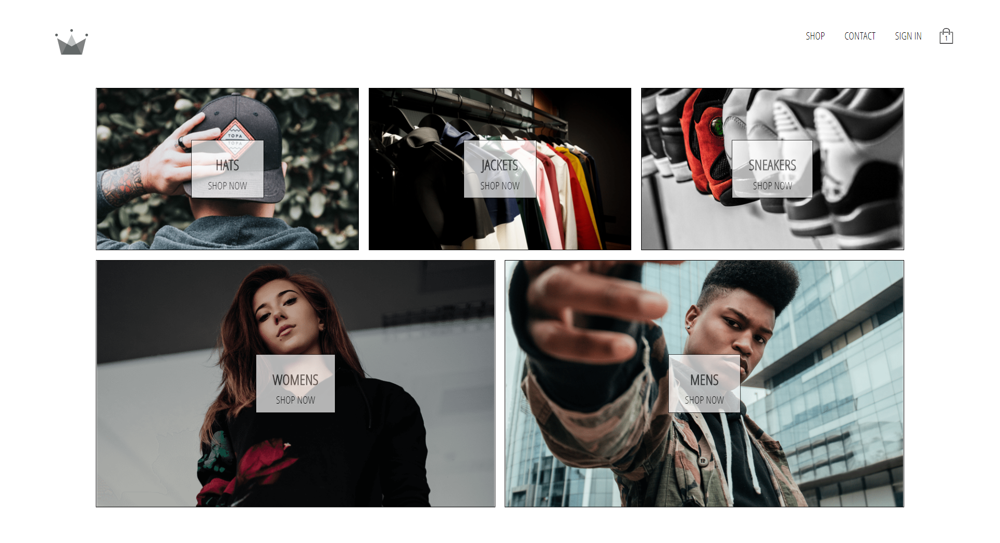
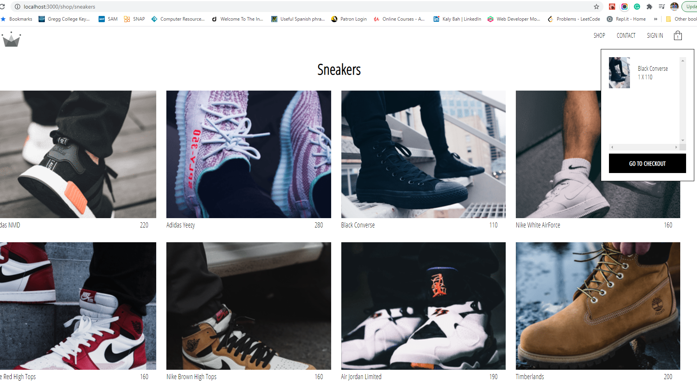
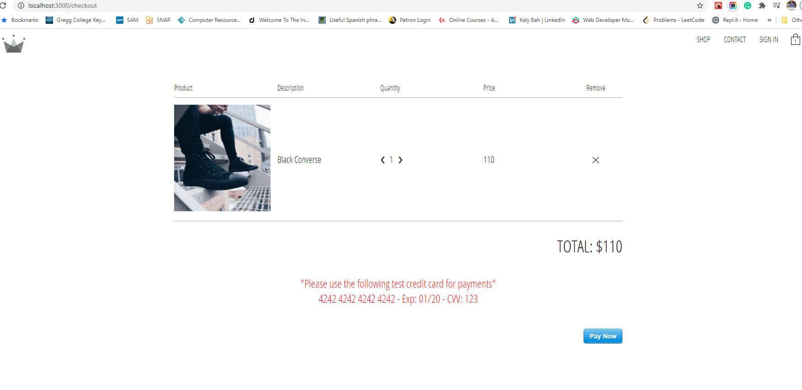
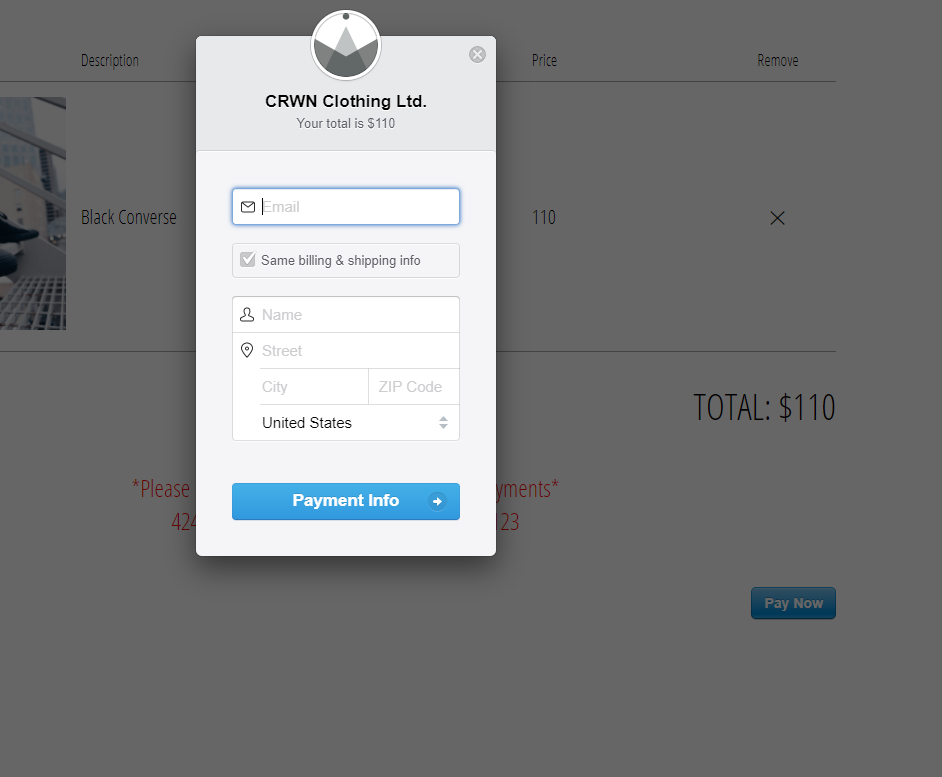

# Crown Clothing E-commerce website

Full complete end-to-end react ecommer app with navigation and routing to take us to different
categories pages on each items and abilities to add in cart and persist the user information for later.
Using Firebase for authentication sign-in and sign-up (with Google signin)
and integrating the stripe api for payement.(Test api of course)

## Usage

Login Page

Front Page with different categories:

- Hats
- Sneaker
- Men
- Women
- Jackets

Categories Page - Sneakers

Cart and Payement

## Installation

1. clone the repo
   `git clone https`

2. Install all the dependencies
   `npm install`
3.

## License

[MIT License](LICENSE)
